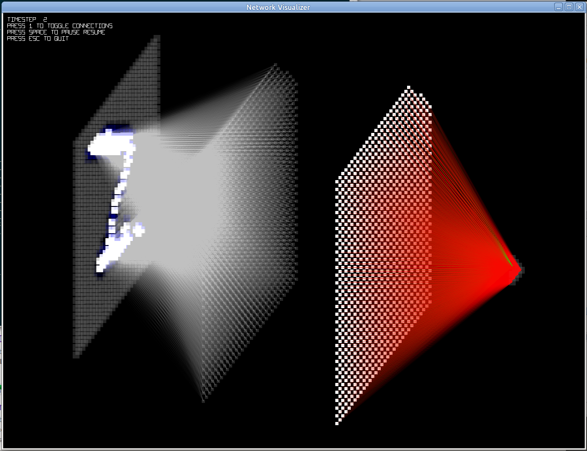

# Zpiking Neural Network

Implementation of a spiking neural network with visualization in Zig.



## Usage

### Installation
```bash
git clone https://github.com/mm318/znn.git
```

### Build
All commands should be run from the `znn` directory.

To build:
```bash
zig build                           # for debug build
zig build -Doptimize=ReleaseSafe    # for release build (recommended)
```

To run (requires MNIST training images and labels):
```bash
zig build -Doptimize=ReleaseSafe run -- path/to/train-images.idx3-ubyte path/to/train-labels.idx1-ubyte
```

### Develop

To format the source code:
```bash
zig fmt .
```


## Requirements

Developed using Ubuntu 20.04 and Zig 0.13.0.
